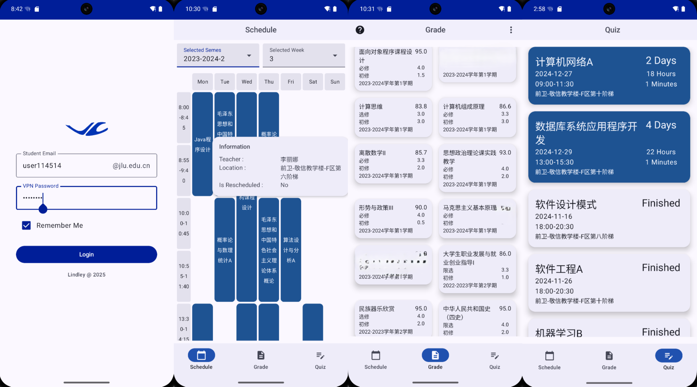
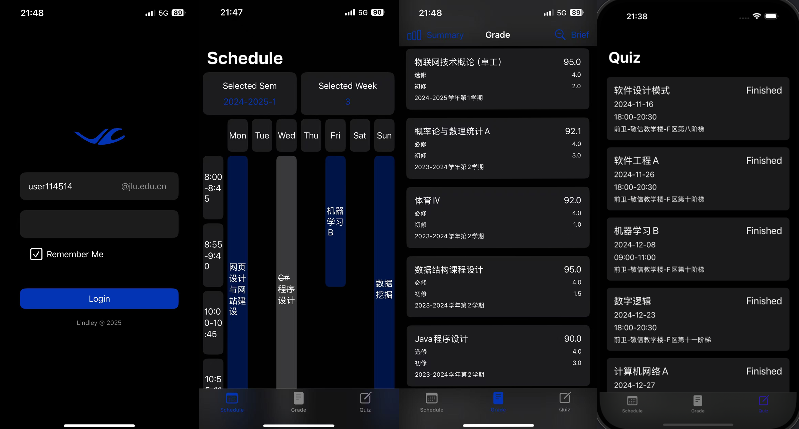

# JLU Cloud
**一个 安卓 苹果 平台的 吉林大学教务系统 课表 成绩 考试时间 显示前端**

本软件仅供吉林大学学生使用 禁止用于研究以及商业用途

## 安装平台

#### 安卓端 [下载](https://github.com/LindleyLin/JLUCloud/releases/download/v1.0.0/JLU.Cloud.apk)
- 能够在大部分类安卓平台运行 *小米 OPPO VIVO 等*
- **鸿蒙**兼容性较差 会有输入问题 解决办法于文末
- 安卓版本较低的机型可能也会有兼容性问题 尚待测试

#### 苹果端 [下载](https://github.com/LindleyLin/JLUCloud/releases/download/v1.0.0/JLU.Cloud.ipa)
- iOS 和 iPadOS 均可使用
- 兼容性问题较少

## 特色功能
- 即时更新的课表
   - 每次登录将从学校服务器拉取最新课表
   - 能够自定义查看的 **学期** 以及 **周数**
   - 每次登录默认查看 **当前周**课表
   - 对于 **调课** 和 **冲突** 的课程以颜色区分
   - 点击课程能够显示课程的 **教师名 上课地点 是否调课**

- 即时成绩查询
   - 每次登录将从学校服务器拉取最新成绩单
   - 能够以 **简略** 和 **详细** 两种模式查看成绩
   - 对于 **通过** 和 **挂科** 的课程以颜色区分
   - 能够自动计算 **每学期的成绩 总成绩 保研成绩***仅供参考*

- 即时的考试时间查询
   - 每次登录将从学校服务器拉取最新考试时间表
   - 对于 **已结束** 和 **未结束** 的考试以颜色区分
   - 尚未结束的考试能够根据当前时间显示距离考试剩余 **天数 小时数 分钟数**

## 说明
### 显示颜色 与 属性 的对应关系
   - 课表
      - 蓝色 -- 正常 或 调课后 的课程
      - 灰色 -- 调课前的课程
      - 红色 -- 时间冲突的课程
   - 成绩
      - 白色 或 灰色 -- 课程通过
      - 红色 -- 挂科
   - 考试时间
      - 灰色 -- 已结束
      - 蓝色 -- 尚未结束
        
### 鸿蒙输入法导致的登录页面文本框键入内容不显示的解决办法

1. 在任意一个能够正常打字的地方（短信 微信等）输入自己的账号
1. 将账号全选 复制
1. 回到登录界面 将内容 粘贴到 账号的文本框
1. 密码同理
1. 勾选 Remember Me 在本设备记住该账号
1. 登录

下一次登录就能正常显示了

### 详细 模式下单个成绩单元格每个数字对应的含义

| 课程名              | 课程分数            |
|---------------------|---------------------|
| 必修 选修 限选       | 绩点                |
| 初修 重修            | 学分                |
| 上课学年学期                               |

### 苹果下载安装包后的安装方法

1. 开启设备的开发者模式
2. 下载电脑端爱思助手 连接设备
3. 使用爱思助手 用你的**Apple ID**对IPA安装包进行**签名**
4. 使用爱思助手 安装**签名后**的安装包
5. 使设备信任软件的开发者证书

即可正常使用 *提示：每 7 天需要重新安装一次*

### 成绩算法

- 保研成绩

除去 **军事理论 体育** 的 **初修的 必修课**
- 学期成绩

包含重修课程
- 总成绩

若有重修课程 取 初修 和 重修 的 **最高分**

## Q & A

1. 为什么不开源？

> 答：防止有人用于非法用途。

2. 我的数据会流经第三方吗，会导致隐私泄露吗？

> 答：不会。该前端所有的API请求全部指向学校官方服务器，不会流经第三方。

3. 为什么界面是英文，未来会有中文版吗？

> 答：项目刚构建时考虑到中文导致乱码的可能性，稳妥起见使用了英文，未来会考虑加入中文。

4. 为什么登陆不上？

> 答：如果连接了校园网Wi-Fi，请切换至流量。

5. 运行时出现了问题怎么办？

> 答：请在 **Issues** 描述你的问题，我会尽快回复。
